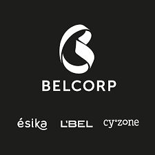

 :(fas fa-exclamation-circle fa-fw): <b>Important: Any views, material or statements expressed are mines and not those of my employer</b> 

---

#### :(far fa-compass fa-fw): About my career

A few years ago, I started studying Industrial Engineering, at the same time, as a hobby, I started learning how to develop mobile games in Unity. Since video games have always been one of my favorite hobbies, I enjoyed learning how to make them and still. Unfortunately, after a year and a half, I put it aside.

Shortly after, a friend told me about Data Science — but at first, it didn't interest me because I didn't have a precise idea of ​​what it was about.

However, one of my favorite topics has always been statistics and probability — and then discovered that some people in the Software Entertainment industry are dedicated to retaining and acquiring users via analytics and data mining techniques to improve the UX and make games sustainable. And most of those people had backgrounds associated with Analytics careers like Data Science and Engineering — which is why I started to get inspired to follow this path.

---

#### :(fas fa-user-graduate fa-fw): Education


Bachelor's degree accredited by the Canadian Engineering Accreditation Board () in the area of Industrial Engineering. Covering areas such as industrial statistics (Minitab), process simulation, computer aided design (CAD, Solid Works), computer aided manufacturing (CAM), industrial process control and programming (CNC), IT project management fundamentals (SCRUM), continuous improvement processes (Lean Six Sigma).

Learn more about this academic degree .



Data Analytics Graduate Program, emphasizing data engineering and analytics, offers advanced statistical analysis through programming languages for Big Data processing. The program includes good Data Engineering practices using the Apache Software Foundation frameworks and adopts application concepts for end-to-end analytical solutions.

Learn more about this academic degree .


---

#### :(fas fa-briefcase fa-fw): Experience


 Analytics Developer in charge of coding/scripting (SQL, Python, etc.) for automating data transformations and loading across business algorithms. Also, responsible for performing data ingestion, transformation, and uploading into applications/engines. This entailed the use of application administration tools (combination of proprietary tools), validating raw data quality (developing test cases with QA scripts), and taking corrective measures in case of issues.

Learn more about the responsibilities of this role at .

> March 2022 - **Present**
> 


Through prescriptive analytics applied in the field of BI within the B2C sales area, commercial sales variables were managed and reported. To create and consult dynamic and real-time reports/dashboards that will make timely decisions for Central American sales plans, according to the needs of sales management.

Learn more about the responsibilities of this role at .

> February 2021 - July 2021
> 


Created and migrated data analytics reports of the Customer Success area in the whole SaaS cycle, embracing all the Customer 360° environment. As well as the CTA predictive analysis according to the PEME needs of early warnings subscription consumption; via commercial, and financial indicators applied to Big Data.

Learn more about the responsibilities of this role at .

> June 2020 - September 2020
> 

---

#### :(fas fa-solid fa-award fa-fw): Honors & awards


Reached the final stage, ranking among the eight finalists for the annual VMware Hackathon. Recognized for developing a mockup of an internal social network to complement the Workspace ONE product. Supporting the proposed solution through a real-time dashboard that uses actual HR data to represent the prospect's impact on the business. The activity was carried out virtually due to the sanitary restrictions of COVID-19.

Learn more about this program at .

> August 2020
> 

---

#### :(fas fa-solid fa-id-card fa-fw): Licenses & certifications


Databricks and Apache Software Foundation validated credential, which demonstrates an understanding of the Apache Spark architecture and the ability to apply the Spark DataFrame API to complete individual data manipulation tasks using parallelization coding with Pyspark.

Validate this credential .

> November 2022
> 

---


console.log('Hello LoveIt!');


#### :(fas fa-hand-holding-medical fa-fw): What can I offer

I'm a data analyst with engineering skills made by a self-learning attitude. With experience in consulting, consumer goods, and virtualization technology industries. Who as an add-on has great enthusiasm for the Software Entertainment industry, in how data analytics can improve it as a business, using pre-development analytics, live metrics, and acquisition/retention analysis; for indie markets and big publishers.

Although I don't consider myself an expert, I do have a curious and creative mind. As the renowned author Austin Kleon once said, "You don't have to be a genius... Sometimes amateurs have more to teach us than experts." I'm always eager to learn and explore new ideas without placing contraints. That's why I enjoy sharing my work and getting feedback from like-minded people. So, if you share the same interests as me, I would be thrilled to help you out in any way I can.

Before I started working as a data analyst, I started out as a self-taught Unity programmer. This describes a very important characteristic of mine, and it is the motivation to continuously learn on my own, in the sense of wanting to explore the unknown and accept new challenges. I like to propose **creative perspectives** to improve in each area of work, especially when it comes to getting the most out of one of today's most valuable resources, data.

---

#### :(fas fa-hiking fa-fw): Personal life & Hobbies

I’m a person who loves to read about issues related to the gaming industry, especially in companies such as Activision Blizzard, Ubisoft, Bethesda, Xbox Studios, Supercell, among others; also in matters of marketing and applicability of Data Analysis in development, design, research and postproduction -- That's why two of my main appeals are **Applied Data Science** and **Game Development**.

Without going too deep, I'm fascinated by following news from high-tech companies (such as Google or Microsoft) about new product releases and market movements. Also like to read books about Business, Productivity, Personal Growth and Video Games. Referring to authors such as Tom Rath, Austin Kleon, James Clear and David Goggins.

Among other personal hobbies, I like playing video games and practicing outdoor sports like trail running. And a fun fact —  I live with a golden Holland Lop named Jacka.

---

#### :(far fa-user fa-fw): Contact section

- Website | [https://robguilar.com](https://www.robguilar.com "Visit Portfolio Website")

- LinkedIn | [https://linkedin.com](https://www.linkedin.com/in/robguilarr/ "Visit LinkedIn Profile")

- GitHub | [https://github.com](https://github.com/robguilarr "Visit GitHub Overview")

- Twitter | [https://twitter.com](https://twitter.com/robguilarr "Visit Twitter Profile")

- Instagram | [https://instagram.com](https://www.instagram.com/robguilarr/ "Visit Instagram Profile")

- Figma | [https://www.figma.com](https://www.figma.com/@robguilarr "Visit Figma Profile")