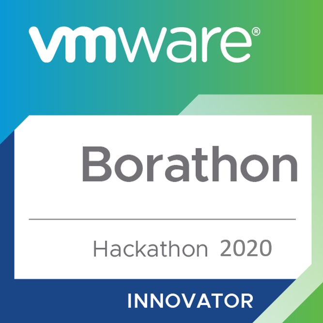
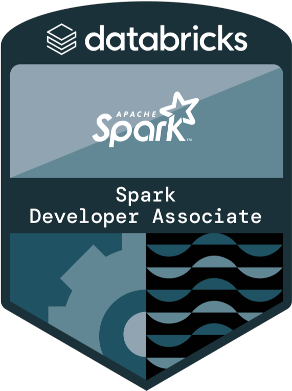

# About

 :(fas fa-exclamation-circle fa-fw): <b>Important: Any views, material or statements expressed are mines and not those of my employer</b> 

---

#### :(far fa-compass fa-fw): About me

As a Data Scientist and Engineer, I specialize in transforming complex data into tangible business outcomes, particularly for the retail and consumer packaged goods sectors.

My expertise lies in deploying advanced analytics algorithms, deep learning solutions, and machine learning approaches.

---

#### :(fas fa-rocket fa-fw): Interests

The passion for exploring the convergence of graphics technology platforms and analytics solutions, particularly in areas such as gaming and the metaverse, has been a driving force in my career, as in the coming years this unique intersection will offer numerous innovative solutions that can contribute effectively to a tangible impact.

My journey in this field was initiated some years ago with a self-taught venture into Unity programming, which not only laid the foundation for my technical background but also sparked this deep interest.

---

#### :(fas fa-briefcase fa-fw): Experience



> Analyst, Software Delivery, **[Lilli GenAI](https://www.mckinsey.com/about-us/new-at-mckinsey-blog/meet-lilli-our-generative-ai-tool "Learn more")**, Feb 2024 - **Present**

Proven impact as Fullstack Data Scientist:

- Contributed in the redesign of an advanced Named Entity Recognition System for McKinsey’s core GenAI product, significantly enhancing the precision of financial information searches using a LLM model (Internal Asset).

- Enhanced various semantic techniques, leading to the development of a prompt engineering strategy that significantly boosted named entity detection coverage by over 45% (Internal Asset).

> Data Scientist, **[QuantumBlack](https://www.mckinsey.com/capabilities/quantumblack/how-we-help-clients "Learn more")**, Sep 2023 - Jan 2024 

Proven impact as Data Scientist (seasonal staff):

- Assetized Competitor Price Index scenario generator capable of increasing 5.2% Gross Margin uplift of middle demand class products within a 6pp CPI variation, in addition to the Python-based pricing recommendation engine (Electronics Retailer).

- Integrated a QuantumBlack deep learning‑based demand transfer engine into Periscope’s Assortment Advisor platform by creating a highly efficient assembly module using PySpark, which resulted in a $3M signed‑up proof‑of‑concept (Food Retailer).

- Enhanced a regressor model reproducibility and performance consistency by integrating a model registry with MLFlow and Databricks.

> Data Analyst, **[Periscope](https://www.mckinsey.com/capabilities/growth-marketing-and-sales/solutions/periscope/overview "Learn more")**, April 2023 - Aug 2023 

Proven impact as Data Engineer:

- Contributed in the migration of a +25TB customer database by seamlessly migrating it from ExasolDB to SparkSQL transcoding, optimizing critical inbound pipelines (Department Store & Luxury Goods).

- Implemented a robust infrastructure within Periscope, orchestrated seamlessly with Jenkins, and enhanced data flow efficiency by integrating with secure SFTP protocols (Department Store & Luxury Goods).

> Junior Data Analyst, **[Periscope](https://www.mckinsey.com/capabilities/growth-marketing-and-sales/solutions/periscope/overview "Learn more")**, March 2022 - Mar 2023

Proven impact as Data Scientist:

- Achieved a 0.5% profit uplift by implementing an AA module that optimized the pricing process by recommending package size relationships within product families of items formed by clusters based on NLP similarity scores (Food Retailer).

---

Learn more about the responsibilities of this role at .





> Junior Business Intelligence Analyst, **[Belcorp](https://www.belcorp.biz/ "Learn more")**, February 2021 - Jul 2021

Proven impact as Business Analyst:

- Developed data analysis tools enabling LatAM teams and managers to derive actionable commercial insights, facilitating informed decision-making into a B2C functionality.

- Integrated BI assets into CRM tasks, enhancing intelligence for service personnel. Designed tailored data collection models for efficient regional visualization.

- Addressed BI inquiries from Central American personnel by creating user-friendly Tableau dashboards, presenting information clearly and comprehensibly.

---

Learn more about the responsibilities of this role at .





> Enterprise Data & Analytics Intern, **[VMware](https://www.vmware.com/ "Learn more")**, June 2020 - Sep 2020

Proven impact as Data Analyst:

- Led comprehensive data analyses throughout the SaaS cycle, uncovering trends and patterns. Utilized data visualization techniques and charts to present findings effectively using Tableau.

- Applied diverse statistical techniques for accurate customer data analysis, ensuring compliance with PEME agreements through CTA predictive analysis in R.

- Expertly managed data extraction, loading, and reconciliation in Amazon Redshift, validating Customer 360° integrity and contributing to project success.

---

Learn more about the responsibilities of this role at .



---

#### :(fas fa-solid fa-award fa-fw): Honors & awards


Reached the final stage, ranking among the eight finalists for the annual VMware Hackathon. Recognized for developing a mockup of an internal social network to complement the Workspace ONE product. Supporting the proposed solution through a real-time dashboard that uses actual HR data to represent the prospect's impact on the business. The activity was carried out virtually due to the sanitary restrictions of COVID-19.

Learn more about this program at .

> August 2020
> 

---

#### :(fas fa-solid fa-id-card fa-fw): Licenses & certifications


Databricks and Apache Software Foundation validated credential, which demonstrates an understanding of the Apache Spark architecture and the ability to apply the Spark DataFrame API to complete individual data manipulation tasks using parallelization coding with Pyspark.

Validate this credential .

> November 2022
> 


The validation of mechanical designs through the application of SOLIDWORKS software, which underscores the proficiency in harnessing its core 3D modeling capabilities, including extrusion and revolution techniques.

Validate this credential ID: C-YKES524TBJ, .

> October 2019
> 

---

#### :(fas fa-user-graduate fa-fw): Education


Bachelor's degree accredited by the Canadian Engineering Accreditation Board () in the area of Industrial Engineering. Covering areas such as industrial statistics (Minitab), process simulation, computer aided design (CAD, Solid Works), computer aided manufacturing (CAM), industrial process control and programming (CNC), IT project management fundamentals (SCRUM), continuous improvement processes (Lean Six Sigma).

Learn more about this academic degree .



Data Analytics Graduate Program, emphasizing data engineering and analytics, offers advanced statistical analysis through programming languages for Big Data processing. The program includes good Data Engineering practices using the Apache Software Foundation frameworks and adopts application concepts for end-to-end analytical solutions.

Learn more about this academic degree .


---

#### :(fas fa-hiking fa-fw): Personal life & Hobbies

I’m a person who loves to read about issues related to the gaming industry, especially in companies such as Activision Blizzard, Ubisoft, Bethesda, Xbox Studios, Supercell, among others; also in matters of marketing and applicability of Data Analysis in development, design, research and postproduction -- That's why two of my main appeals are **Applied Data Science** and **Game Development**.

Among other personal hobbies, I like playing video games and practicing outdoor sports like trail running. And a fun fact —  I live with a golden Holland Lop named Jacka.

---

#### :(far fa-user fa-fw): Contact section

- Mail | [roberto.aq@outlook.com](mailto:roberto.aq@outlook.com "Send me a mail")

- GitHub | [https://github.com](https://github.com/robguilarr "Visit GitHub Overview")

- LinkedIn | [https://linkedin.com](https://www.linkedin.com/in/robguilarr/ "Visit LinkedIn Profile")

- Instagram | [https://instagram.com](https://www.instagram.com/robguilarr/ "Visit Instagram Profile")

- Figma | [https://www.figma.com](https://www.figma.com/@robguilarr "Visit Figma Profile")

