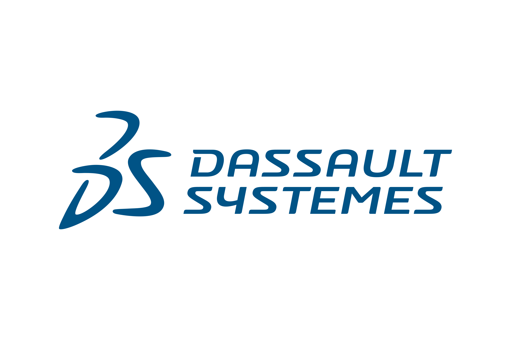

# About

 :(fas fa-exclamation-circle fa-fw): <b>Important: Any views, material or statements expressed are mines and not those of my employer</b> 

---

#### :(far fa-compass fa-fw): About me

As a Data Scientist within Growth, Marketing and Sales, I've made a significant impact across various commercial sectors, including tech, consumer goods, and retail. Working closely with clients to deliver production-level assets based on advanced analytics algorithms, deep learning, and GenAI RAG systems for scalable E2E solutions.

---

#### :(fas fa-rocket fa-fw): Interests

I've a lifelong interest in combining gaming growth and AI solutions for digital platforms, with a particular focus on free-to-play mobile gaming and the metaverse.

This journey began with a self-taught venture into Unity as a Game Developer when I was young, which sparked my deep interest and laid the foundation for my technical skills in this sector.

---

#### :(fas fa-briefcase fa-fw): Experience



> Analyst, Growth AI - **[CustomerOne](https://www.mckinsey.com/capabilities/growth-marketing-and-sales/solutions/customerone/overview "Learn more")** | Aug 2024 - **Present**

As a Data Scientist specializing in Customer Sales Growth and AI-driven CRM systems, I leverage data and advanced AI techniques to empower customer relationship management and drive sales growth within B2B functionalities.

> Data Scientist, Generative AI Core Tech - **[Lilli GenAI](https://www.mckinsey.com/about-us/new-at-mckinsey-blog/meet-lilli-our-generative-ai-tool "Learn more")** | Feb 2024 - Jul 2024

As Data Scientist and Software Engineer at Lilli, McKinsey’s Generative AI live service. I led the creation of the core NER system powered by LLMs, spaCy and GLiNER, to enhance knowledge graph or any consumer queries. My work drove significant advances in document entities parsing and response accuracy, making a tangible impact on our GenAI capabilities.

- Reduced false-negative detection rates by 70% with a custom LLM-powered NER package, implemented on top of the RAG workflow on FastAPI.
- Enhanced response speed by 71% through GLiNER, improving LLM-based NER processing.
- Boosted adoption across 5+ workstreams with a few-shot prompt engineering module as a Python Package.

> Data Scientist, CommercialX - **[QuantumBlack AI](https://www.mckinsey.com/capabilities/quantumblack/how-we-help-clients "Learn more")** | Sep 2023 - Jan 2024 

As a Data Scientist at CommercialX, QuantumBlack's retail verticals analytics engine, I focused on developing high-impact solutions in pricing and assortment optimization. My contributions played a critical role in supporting successful client deployments under a BOT model.

- 5.2% gross margin uplift achieved for mid-demand products by developing a Python optimization algorithm for gross margin maximization, leveraging XGBoost pricing model outputs, within a 6 pp CPI variation.
- 4+ hours of runtime reduction realized by engineering a high-performance distributed computing module using PySpark, optimizing data migration between Databricks DBFS and Azure Blob Storage while exporting Gensim-based neural network outputs for product complementarity.

> Data Analyst, Growth Marketing & Sales - **[Periscope](https://www.mckinsey.com/capabilities/growth-marketing-and-sales/solutions/periscope/overview "Learn more")** | April 2023 - Aug 2023 

As a Data Engineer on Periscope's comprehensive suite for growth within pricing and promo solutions, I focused on migrating big data workflows for a Fortune 500 North American department store. My work was instrumental in optimizing data processes and infrastructure under a SaaS model.

- 25TB customer database migrated by seamlessly transitioning from ExasolDB to SparkSQL, optimizing critical inbound pipelines.
- Enhanced data flow efficiency by implementing a robust infrastructure within Periscope, orchestrated with Jenkins, and integrated with secure SFTP protocols.

> Junior Data Analyst, Growth Marketing & Sales - **[Periscope](https://www.mckinsey.com/capabilities/growth-marketing-and-sales/solutions/periscope/overview "Learn more")** | March 2022 - Mar 2023

As a Data Scientist and Developer at Periscope, I coded a NLP algorithm for product size and price recommendation management, delivering expert-tailored rule-based solutions for retail pricing and assortment use cases.

- 40% speed improvement achieved by optimizing the search and build of product-pricing relationships using a Python TreeNode algorithm, detecting over 5 relationship types in the client’s product shelf assortment.
- 0.5% profit uplift realized by implementing an AA module that optimized the pricing process, recommending package size relationships within product families based on Cosine similarity clusters.

---

Learn more about the responsibilities of this role at .





> Junior Business Intelligence Analyst - **[Belcorp](https://www.belcorp.biz/ "Learn more")** | February 2021 - Jul 2021

As a Business Analyst at Belcorp, a leading multinational in Beauty and Personal Care Cosmetics, I supported data-driven solutions that empowered LatAM business teams and managers.

- Enabled informed decision-making by developing data analysis tools for LatAM teams, driving actionable commercial insights within a B2C framework.
- Enhanced service intelligence by integrating BI assets into CRM tasks and designing tailored data collection models for efficient regional visualization.
- Improved data accessibility by creating user-friendly Tableau dashboards that addressed BI inquiries from Central American personnel, presenting information clearly and effectively.

---

Learn more about the responsibilities of this role at .





> Enterprise Data & Analytics Intern - **[VMware](https://www.vmware.com/ "Learn more")** | June 2020 - Sep 2020

As a Data Analyst at VMware (Broadcom Inc.), where I supported data analysis initiatives throughout the SaaS cycle, providing actionable insights.

- Uncovered key trends and patterns by leading comprehensive data analyses throughout the SaaS cycle, utilizing Tableau for effective data visualization and presentation.
- Ensured compliance by applying diverse statistical techniques for accurate customer data analysis, conducting CTA predictive analysis in R to uphold PEME agreements.
- Validated Customer 360° integrity by expertly managing data extraction, loading, and reconciliation in Amazon Redshift, directly contributing to the success of major projects.

---

Learn more about the responsibilities of this role at .



---

#### :(fas fa-solid fa-award fa-fw): Honors & awards


Reached the final stage, ranking among the eight finalists for the annual VMware Hackathon. Recognized for developing a mockup of an internal social network to complement the Workspace ONE product. Supporting the proposed solution through a real-time dashboard that uses actual HR data to represent the prospect's impact on the business. The activity was carried out virtually due to the sanitary restrictions of COVID-19.

Learn more about this program at .

> August 2020
> 

---

#### :(fas fa-solid fa-id-card fa-fw): Licenses & certifications


Databricks and Apache Software Foundation validated credential, which demonstrates an understanding of the Apache Spark architecture and the ability to apply the Spark DataFrame API to complete individual data manipulation tasks using parallelization coding with Pyspark.

Validate this credential .

> November 2022
> 


Credential that validates mechanical design ability through the application of SOLIDWORKS software, highlighting proficiency in leveraging core 3D modeling capabilities, including extrusion and revolution techniques.

Validate this credential ID: C-YKES524TBJ, .

> October 2019
> 

---

#### :(fas fa-user-graduate fa-fw): Education


Bachelor's degree accredited by the Canadian Engineering Accreditation Board () in the area of Industrial Engineering. Covering areas such as industrial statistics (Minitab), process simulation, computer aided design (CAD, Solid Works), computer aided manufacturing (CAM), industrial process control and programming (CNC), IT project management fundamentals (SCRUM), continuous improvement processes (Lean Six Sigma).

Learn more about this academic degree .



Data Analytics Graduate Program, emphasizing data engineering and analytics, offers advanced statistical analysis through programming languages for Big Data processing. The program includes good Data Engineering practices using the Apache Software Foundation frameworks and adopts application concepts for end-to-end analytical solutions.

Learn more about this academic degree .


---

#### :(fas fa-user-check fa-fw): Voluteering


Contributed to the beta testing of NVIDIA AI Workbench, identifying software issues and providing feedback to improve usability and performance.

Product on testing: Unified, easy-to-use toolkit that allows developers to quickly create, test and customize pretrained generative AI models and LLMs on a PC or workstation, which can scale them to virtually any data center, public cloud or NVIDIA DGX Cloud. Using a simplified user interface enables collaboration across AI project teams and streamlined access to popular repositories like Hugging Face, GitHub and NVIDIA NGC.

Learn more about the product .



---

#### :(fas fa-hiking fa-fw): Personal life & Hobbies

I’m a person who loves to read about issues related to the gaming industry, especially in companies such as Activision Blizzard, Ubisoft, Bethesda, Xbox Studios, Supercell, among others; also in matters of marketing and applicability of Data Analysis in development, design, research and postproduction -- That's why two of my main appeals are **Applied Data Science** and **Game Development**.

Among other personal hobbies, I like playing video games and practicing outdoor sports like trail running. And a fun fact —  I live with a golden Holland Lop named Jacka.

---

#### :(far fa-user fa-fw): Contact section

- Mail | [roberto.aq@outlook.com](mailto:roberto.aq@outlook.com "Send me a mail")

- GitHub | [https://github.com](https://github.com/robguilarr "Visit GitHub Overview")

- LinkedIn | [https://linkedin.com](https://www.linkedin.com/in/robguilarr/ "Visit LinkedIn Profile")

- Instagram | [https://instagram.com](https://www.instagram.com/robguilarr/ "Visit Instagram Profile")

- Figma | [https://www.figma.com](https://www.figma.com/@robguilarr "Visit Figma Profile")

